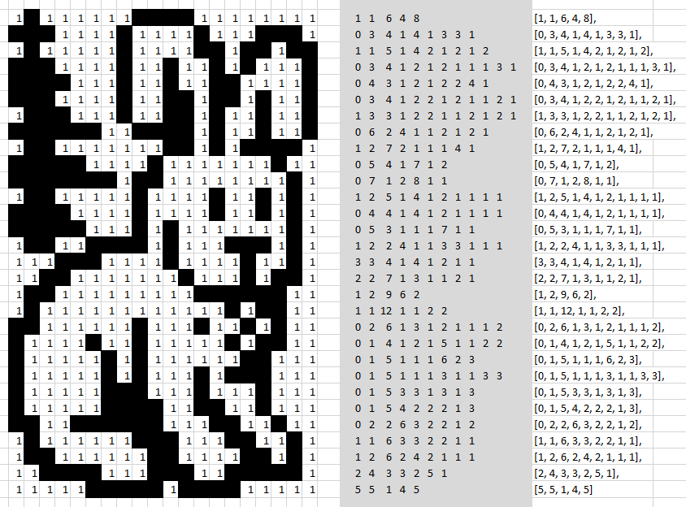
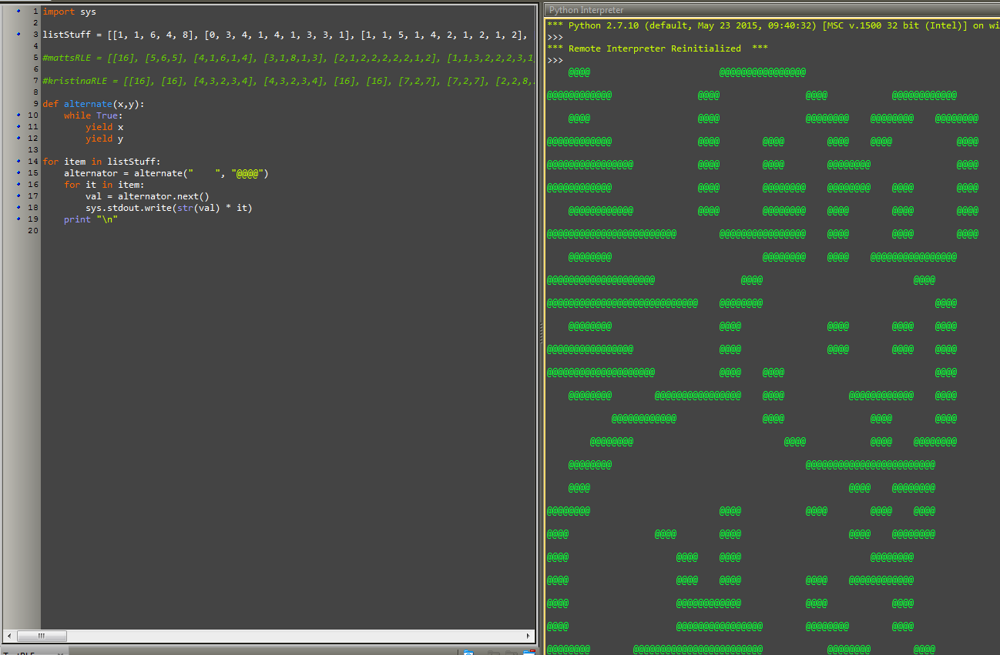

# Run Line Encoding (TestRLE.py)
## Synopsis

This [script] (TestRLE.py) was developed to automate the process that creates text images from a list of list of integers that represent alternating binary cells.

## Script Inputs

*Input Example:*
+ hare = [[1, 1, 6, 4, 8], [0, 3, 4, 1, 4, 1, 3, 3, 1], [1, 1, 5, 1, 4, 2, 1, 2, 1, 2], [0, 3, 4, 1, 2, 1, 2, 1, 1, 1, 3, 1], [0, 4, 3, 1, 2, 1, 2, 2, 4, 1], [0, 3, 4, 1, 2, 2, 1, 2, 1, 1, 2, 1], [1, 3, 3, 1, 2, 2, 1, 1, 2, 1, 2, 1], [0, 6, 2, 4, 1, 1, 2, 1, 2, 1], [1, 2, 7, 2, 1, 1, 1, 4, 1], [0, 5, 4, 1, 7, 1, 2], [0, 7, 1, 2, 8, 1, 1], [1, 2, 5, 1, 4, 1, 2, 1, 1, 1, 1], [0, 4, 4, 1, 4, 1, 2, 1, 1, 1, 1], [0, 5, 3, 1, 1, 1, 7, 1, 1], [1, 2, 2, 4, 1, 1, 3, 3, 1, 1, 1], [3, 3, 4, 1, 4, 1, 2, 1, 1], [2, 2, 7, 1, 3, 1, 1, 2, 1], [1, 2, 9, 6, 2], [1, 1, 12, 1, 1, 2, 2], [0, 2, 6, 1, 3, 1, 2, 1, 1, 1, 2], [0, 1, 4, 1, 2, 1, 5, 1, 1, 2, 2], [0, 1, 5, 1, 1, 1, 6, 2, 3], [0, 1, 5, 1, 1, 1, 3, 1, 1, 3, 3], [0, 1, 5, 3, 3, 1, 3, 1, 3], [0, 1, 5, 4, 2, 2, 2, 1, 3], [0, 2, 2, 6, 3, 2, 2, 1, 2], [1, 1, 6, 3, 3, 2, 2, 1, 1], [1, 2, 6, 2, 4, 2, 1, 1, 1], [2, 4, 3, 3, 2, 5, 1], [5, 5, 1, 4, 5]]

## Motivation

We were required to create and decipher other students run-line encoding examples.  I took the next step and created a python script that would do this for me, as opposed to drawing them out by hand.

## Installation

Save and download the TestRLE.py

## Tests

This script was developed and tested with Python 2.7

## Contributors

Michael Harris is the author of this script.

[StackOverflow] (http://stackoverflow.com/users/4530995/michael-harris)

[LinkedIN] (https://www.linkedin.com/in/michael-harris-366b0060/)

## License

This code is available under the [MIT License.] (LICENSE.txt)
